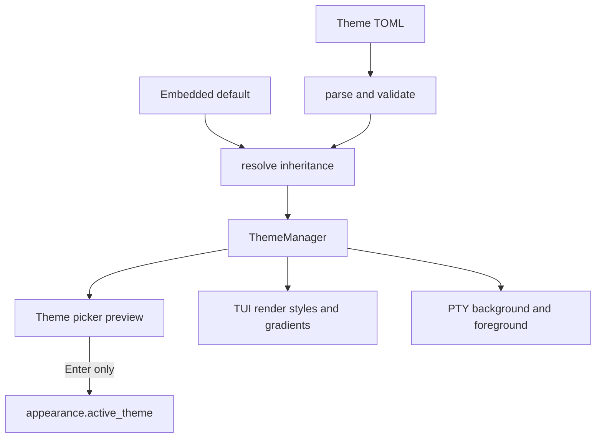

# Runtime Themes

SSHub moved TUI colors from constants into TOML themes in 0.14.0. A theme can customize a palette, the fixed semantic core, per-component roles, and named static gradients. Omitted values inherit from `default`, so a small override remains forward-compatible as new roles are added.

## Files and resolution

Theme files are discovered as `~/.config/sshub/themes/*.toml`; the filename is the theme ID. The five built-ins (`default`, `summer`, `aqua`, `fire`, and `high-contrast`) are embedded in the binary and can be inspected with `sshub theme show`. `config.toml` stores only `appearance.active_theme`; it does not copy the resolved theme into the profile config.

The parser and validator (`src/theme/parse.rs`, `src/theme/validate.rs`) accept hex colors, explicit `rgb`, references with brightness and simulated opacity over an explicit ground, and the sentinels `terminal`, `auto`, and `native`. `ThemeManager` (`src/theme/manager.rs`) loads and resolves the selected theme. Invalid files stay visible in the picker with diagnostics; unknown roles produce a warning and do not invalidate a theme that otherwise parses.

This flow shows the distinction between preview/resolution and the persisted active-theme setting.

## Picker behavior and rendering boundaries

`Ctrl+H` → **Theme…** opens `src/tui/screens/theme_picker.rs`. Moving through the list previews the complete interface and shows a two-box detail preview. `Esc` restores the previously active theme; `r` rereads the theme directory; only `Enter` writes the selection. The picker drives the real profile-aware config writer, so a selection persists in the profile config rather than an unrelated global file.

Static gradients have five directions (`horizontal`, `vertical`, `diagonal_down`, `diagonal_up`, `perimeter`). They are applied by buffer post-processing without per-cell allocation. The app background and gradients do not recolor the embedded remote session. The `pty_background` and `pty_foreground` semantic slots provide the remote grid ground as a pair; colors selected by the remote application remain untouched.

Transparency is controlled by two independent settings: `appearance.transparent_sshub_background` releases SSHub's own ground, and `appearance.transparent_session_background` releases the remote grid. Both default off. `opaque_background` is obsolete and ignored. Transparency releases the ground but preserves selection, borders, status colors, and other drawn chrome; it is not an alpha slider.

## Headless API and change guidance

`sshub theme check`, `list`, and `show` do not open the TUI or databases. `check` reports file/line/column diagnostics and suggestions; `show --resolved` emits a standalone resolved document that can be read back as the same theme. Public theme types are re-exported through the library surface and exercised by `tests/smoke/theme_public_api.rs`, not only by internal unit tests.

When adding a theme field or role, update the model/parser/validator/resolver, built-in role snapshot and user-facing theme docs, then verify the picker and public CLI. When changing rendering or PTY ground behavior, inspect `src/tui/`, `src/session/render.rs`, and the theme picker tests. Do not hand-edit generated role catalogues; use the repository's theme generation/source workflow documented in `docs/theme-system.md`.

Focused checks: `cargo test --test theme_public_api --test e2e -- theme`. Use the broader `cargo test` and release build only when changing shared rendering, packaging, or release artifacts.

Related concepts: the [TUI dashboard](tui.md) consumes resolved roles and picker state; [embedded sessions and SFTP](sessions-sftp.md) define the PTY boundary; [data model and storage](../architecture/data-model.md) explains where the active theme setting is persisted.
